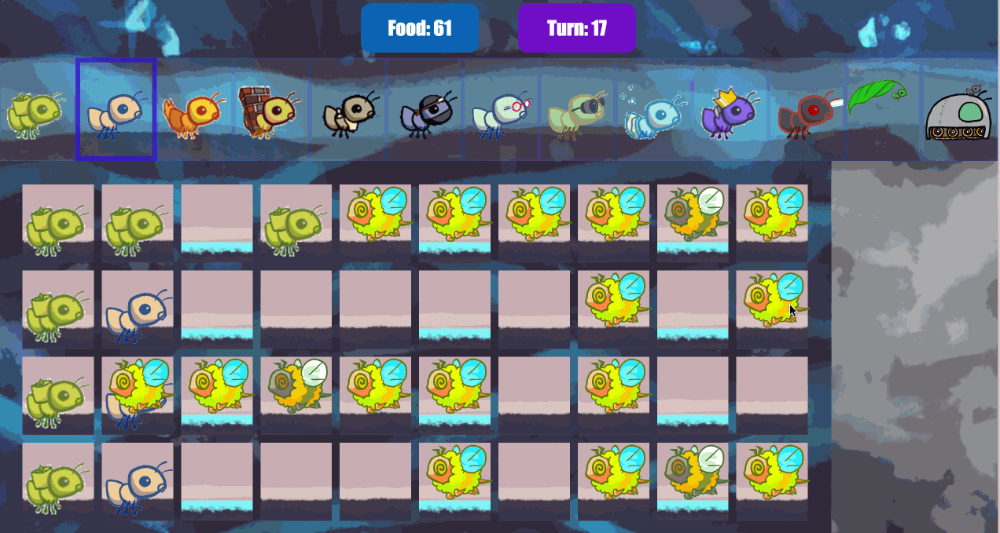

# Ants Vs. SomeBees

This is a <a href="https://secure.wikimedia.org/wikipedia/en/wiki/Tower_defense">tower defense</a> game called Ants Vs.SomeBees. As the ant queen, you populate your colony with the bravest ants you
can muster. Your ants must protect their queen from the evil bees that invade
your territory. Irritate the bees enough by throwing leaves at them, and they
will be vanquished. Fail to pester the airborne intruders adequately, and your
queen will succumb to the bees' wrath. This game is inspired by PopCap Games'
<a href="https://www.ea.com/studios/popcap/plants-vs-zombies">Plants Vs. Zombies</a>.

This project uses an object-oriented programming paradigm. The project also involves understanding, extending, and testing a large program.

## The game

A game of Ants Vs. SomeBees consists of a series of turns. In each turn, new bees may enter the ant colony. Then, new ants are placed to defend their colony. Finally, all insects (ants, then bees) take individual actions. Bees either try to move toward the end of the tunnel or sting ants in their way. Ants perform a different action depending on their type, such as collecting more food or throwing leaves at the bees. The game ends either when a bee reaches the end of the tunnel (ants lose), the bees destroy a QueenAnt if it exists (ants lose), or the entire bee fleet has been vanquished (ants win).

### Core concepts

<strong>The Colony</strong>. This is where the game takes place. The colony consists of
several <code>Place</code>s that are chained together to form tunnels through which the
bees travel. The colony also has some quantity of food which can be expended in
order to place an ant in a tunnel.

<strong>Places</strong>. A place links to another place to form a tunnel. The player can
put a single ant into each place. However, there can be many bees in a single
place.

<strong>The Hive</strong>. This is the place where bees originate. Bees exit the beehive to
enter the ant colony.

<strong>Ants</strong>. The player places an ant into the colony by selecting from the
available ant types at the top of the screen.
Each type of ant takes a different action and requires a different
amount of colony food to place. The two most basic ant types are the <code>HarvesterAnt</code>,
which adds one food to the colony during each turn, and the <code>ThrowerAnt</code>, which
throws a leaf at a bee each turn. You will be implementing many more!

<strong>Bees</strong>. Each turn, a bee either advances to the next place in the tunnel if no
ant is in its way, or it stings the ant in its way. Bees win when at least one
bee reaches the end of a tunnel. In addition to the orange bees, there are
yellow wasps that do double damage and a green boss bee that is quite difficult
to vanquish.

Here is a [diagram](./img/ants_diagram.pdf) of all of the ants' classes and their inheritance relationships.

## Playing the game

To start this game, run:

<pre><code>python3 gui.py</code></pre>

After you start the graphical version, the game is (usually) available at
http://127.0.0.1:31415/.

The game has several options that you will use throughout the project,
which you can view with <code>python3 gui.py &#x2d;&#x2d;help</code>.

<pre><code>usage: gui.py [&#x2d;h] [&#x2d;d DIFFICULTY] [&#x2d;w] [&#x2d;&#x2d;food FOOD]

Play Ants vs. SomeBees

optional arguments:
  &#x2d;h, &#x2d;&#x2d;help     show this help message and exit
  &#x2d;d DIFFICULTY  sets difficulty of game (test/easy/normal/hard/extra&#x2d;hard)
  &#x2d;w, &#x2d;&#x2d;water    loads a full layout with water
  &#x2d;&#x2d;food FOOD    number of food to start with when testing</code></pre>

You can refresh the webpage to restart the game, but if you changed your code,
you need to terminate <code>gui.py</code> and run it again. To terminate <code>gui.py</code>, you can
hit <code>Ctrl + C</code> on the terminal.

You cannot have multiple tabs of this same Ants GUI open simultaneously or they
will all error.
